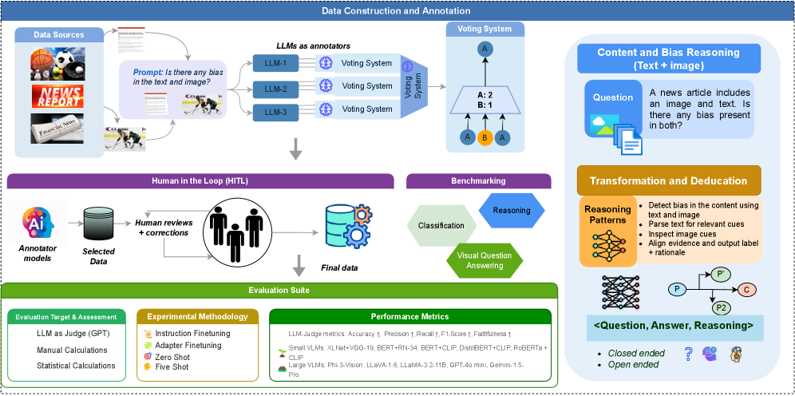

# ViLBias — Detecting and Reasoning about Bias in Multimodal Content

VILBias is a framework designed to detect and analyze bias in multimodal contexts, integrating linguistic and visual cues to improve transparency, accountability, and fairness in media representation.

[](LICENSE) 
[](DATA_LICENSE)

<!-- Teaser -->
<p align="center">
  
</p>

## Abstract

Detecting bias in multimodal news requires models that **reason over text–image pairs**, not just classify text. In response, we present **ViLBias**, a **VQA-style benchmark and framework** for detecting and reasoning about bias in multimodal news. The dataset comprises **40,945** text–image pairs from diverse outlets, each annotated with a **bias label and concise rationale** using a **two-stage LLM-as-annotator pipeline** with **hierarchical majority voting** and **human-in-the-loop** validation. We evaluate **Small Language Models (SLMs)**, **Large Language Models (LLMs)**, and **Vision–Language Models (VLMs)** across **closed-ended classification** and **open-ended reasoning (oVQA)**, and compare **parameter-efficient tuning** strategies. Results show that **incorporating images** alongside text improves detection accuracy by **3–5%**, and that **LLMs/VLMs** better capture subtle framing and text–image inconsistencies than SLMs. **Parameter-efficient methods (LoRA/QLoRA/Adapters)** recover **97–99%** of full fine-tuning performance with **<5% trainable parameters**. For oVQA, **reasoning accuracy = 52–79%** and **faithfulness = 68–89%**, both improved by **instruction tuning**; **closed accuracy correlates strongly with reasoning (r = 0.91)**. ViLBias offers a **scalable benchmark** and **strong baselines** for multimodal bias detection and rationale quality.

## Contribution

We welcome contributions to improve VILBias. Please follow these steps to contribute:
1. Fork this repository.
2. Create a new branch for your feature or bug fix:
   ```bash
   git checkout -b feature-name
   ```
3. Commit your changes and push the branch:
   ```bash
   git commit -m "Description of changes"
   git push origin feature-name
   ```
4. Create a pull request.

## License

Licensed under **Creative Commons Attribution–NoDerivatives 4.0 International (CC BY-ND 4.0)**.  
See [DATA_LICENSE](DATA_LICENSE) or the [human-readable summary](https://creativecommons.org/licenses/by-nd/4.0/deed.en).